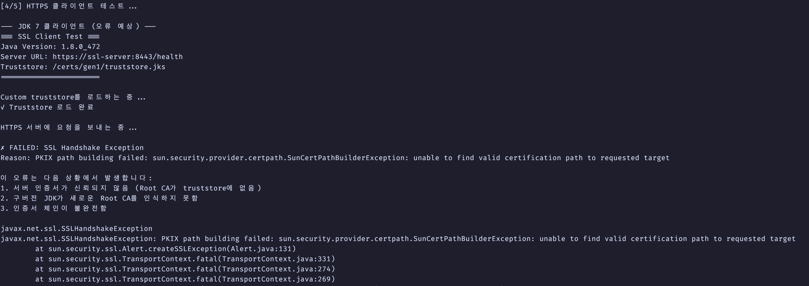

# SSL_Certificate

SSL 인증서에 대한 기본 개념 및 실습을 진행합니다.

## SSL 인증서

SSL 인증서는 서버의 공개키와 이를 보증하는 CA의 전자서명를 포함합니다. CA 전자서명을 통해 우리는 서버의 공개키를 신뢰할 수 있습니다.

SSL/TLS 프로토콜을 사용하는 HTTPS 프로토콜은 클라이언트-서버 간 정보 암호화를 위해 대칭키를 교환해야합니다. 그 과정에서 서버의 공개키를 획득해야하고 이를 위해 SSL 인증서가 필요합니다.

- 참고 : https://gruuuuu.hololy.org/security/what-is-x509/

## 동작과정

동작과정은 아래 링크에 정리가 되어있습니다.

- 참고 : https://www.cloudflare.com/ko-kr/learning/ssl/what-happens-in-a-tls-handshake/

## SSL 인증서 교체 시, 예상되는 문제

위 동작과정 중, 3번은 아래처럼 작성되어 있습니다.

| 인증: 클라이언트가 서버의 SSL 인증서를 인증서 발행 기관을 통해 검증합니다

JDK는 cacert안에 자신이 신뢰하는 CA 목록을 관리합니다. 목록에 있다면 "신뢰할 수 있는 서버구나" 하고 통신을 시작합니다. 목록에 없다면 PKIX path building failed (신뢰할 수 없는 인증서) 에러를 뱉으며 연결을 거부합니다.

## SSL vs SSH

이름이 비슷한 SSH는 SSL과 동작 방식은 조금 다릅니다. SSL은 공개키에 대한 보증을 CA에서 진행하지만 SSH은 보증을 할 사람이 없습니다. 어쩔 수 없이 처음에 한번 공개키를 신뢰하는 과정이 필요하고 이를 TOFU라고 합니다.

SSH의 TOFU(Trust On First Use) 원리에 따라 서버의 호스트 공개키는 클라이언트 측 사용자 홈 디렉토리의 `~/.ssh/known_hosts` 파일에 저장됩니다

이에 대한 메세지는 아래와 같이 생겼습니다.

```
The authenticity of host '192.168.0.25 (192.168.0.25)' can't be established.
ECDSA key fingerprint is  ~
Are you sure you want to continue connecting (yes/no/[fingerprint])?
```

## 실습

### 01. 프로젝트 목표

1. **1세대 인증서 시나리오**: HTTPS 서버에 1세대 인증서 적용 → 클라이언트 요청 → 정상 동작 확인
2. **2세대 인증서 시나리오**: 2세대 인증서로 교체 → 구버전 JDK 클라이언트 요청 → 인증 오류 발생 확인
3. **해결 방법 시나리오**: 2세대 Root CA를 truststore에 수동 등록 → 다시 정상 동작 확인

### 02. 필수 요구사항

- Docker & Docker Compose
- Maven 3.6+
- OpenSSL
- Java 8+

### 03. 시작

```bash
# 1. 프로젝트 디렉토리 이동

# 2. 인증서 생성
cd certs && ./generate-certs.sh && cd ..

# 3. 프로젝트 빌드
cd server && mvn clean package -DskipTests && cd ..
cd client && mvn clean package && cd ..

# 4. 시나리오 1 실행 (1세대 정상 동작)
./scripts/test-gen1.sh

# 5. 시나리오 2 실행 (2세대 실패 재연)
./scripts/test-gen2-fail.sh

# 6. 시나리오 3 실행 (해결 방법)
./scripts/test-gen2-success.sh
```

### 04. 프로젝트 구조

```
SSL_Certificate/
├── README.md                           # 이 파일
├── certs/                              # SSL 인증서 디렉토리
│   ├── gen1/                           # 1세대 Root CA
│   │   ├── root-ca.crt                 # Root CA 인증서
│   │   ├── server.p12                  # Spring Boot용 PKCS12
│   │   └── truststore.jks              # 클라이언트용 truststore
│   ├── gen2/                           # 2세대 Root CA
│   │   ├── root-ca.crt
│   │   ├── server.p12
│   │   └── truststore.jks
│   └── generate-certs.sh               # 인증서 생성 스크립트
├── server/                             # Spring Boot HTTPS 서버
│   ├── pom.xml
│   ├── Dockerfile
│   └── src/main/
│       ├── java/com/example/sslserver/
│       │   ├── SslServerApplication.java
│       │   └── HealthController.java
│       └── resources/
│           └── application.yml
├── client/                             # Java HTTPS 클라이언트
│   ├── pom.xml
│   ├── Dockerfile.jdk7
│   ├── Dockerfile.jdk8
│   └── src/main/java/com/example/sslclient/
│       └── HttpsClient.java
├── docker-compose.yml                  # Docker Compose 설정
└── scripts/                            # 테스트 자동화 스크립트
    ├── test-gen1.sh                    # 시나리오 1: 1세대 정상
    ├── test-gen2-fail.sh               # 시나리오 2: 2세대 실패
    └── test-gen2-success.sh            # 시나리오 3: 해결 방법
```

### 05. 결과

2번 케이스에 대해서만 사진을 첨부하면 다음과 같은 결과를 확인할 수 있습니다


