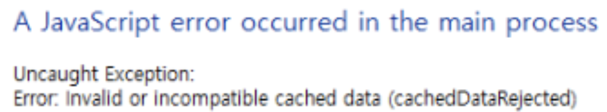

## Multi_architecture

64비트 아키텍처에서 32비트 빌드를 할 수 있는지 확인합니다.

## 문제

- 단순하게 `npm run build && electron-builder --win --x32` 명령어를 사용하면 실행하면 위 오류가 발생합니다.

## 원인

- Electron은 성능을 높이기 위해 미리 컴파일된 바이트코드 캐시를 사용합니다.
- 바이트코드 자체는 아키텍처와 무관하지만, 최적화 메타데이터 때문에 결국 CPU에 종속적입니다.
- 따라서, 문제가 발생하는 이유은 `bytecodePlugin()` 이 컴파일 단계에서 사용하는 Electron의 아키텍처 때문입니다.

> Electron-based compilation - Launches Electron process to compile bundles into .jsc files, ensuring bytecode compatibility with Electron's Node environment

## 해결

- 따라서 ELECTRON_EXEC_PATH를 통해 32비트 빌드 시 사용하는 32비트용 Electron 경로를 잡아주면 문제를 해결할 수 있습니다.
